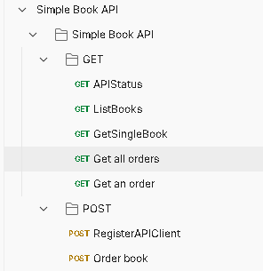
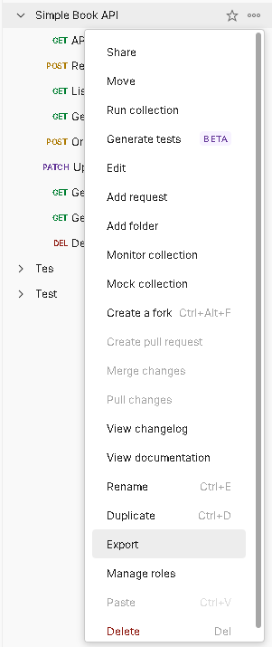
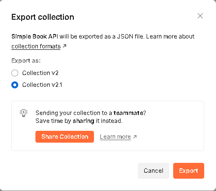
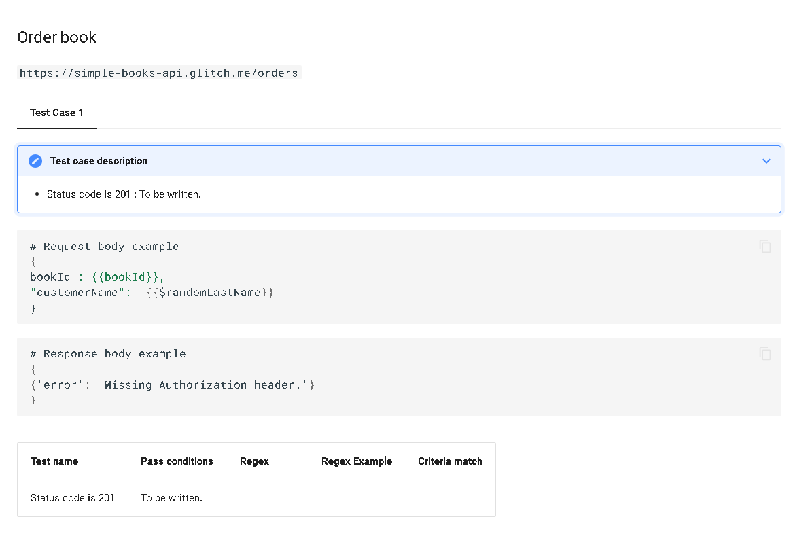

# postman-to-mkdocs-markdown

The repository provides a python script to convert Postman collections into mkdocs-material markdown documents, allowing you to seamlessly integrate API documentation into your MkDocs project.

## Install Dependencies

```
pip install request
```

## Usage

### Step 1: Organize Your Postman Collection

Before converting to MkDocs, organize your Postman collection by following these steps:



> It currently supports only `GET` and `POST`.


### Step 2: Export collections






### Step 3: Run the python script
```
python3 json2markdown.py -j Simple-Book-API-postman_collection.json
```

- `-j [collections-file]`, `--json-dir [collections-file]`

    Specify the file path for collections.

## Result

The script will create `output_markdown_file.md` file.
It helps you quickly create a template for use with mkdocs-material.

```
Generating markdown file ...
Markdown content saved to ./output_markdown_file.md
```


### With [mkdocs-material](https://github.com/squidfunk/mkdocs-material)



## Contributions
If you encounter any issues or have improvement suggestions, feel free to contribute by submitting issues or pull requests.

